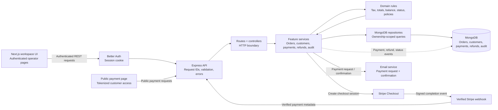

# CrossVal

CrossVal is an order-operations workspace. Authenticated operators create orders, manage customers, calculate tax and balances, send secure payment links, record payments, process refunds, and review the complete order lifecycle.

This README explains the objective, core features, system design, backend/API behavior, local development, integrations, testing, and deployment expectations so a new developer can understand the complete application.

## Contents

- [Objective and product overview](#1-system-overview)
- [Repository structure and modules](#2-repository-structure)
- [Core business rules](#3-core-business-rules)
- [API design and endpoints](#4-api-design)
- [Email and payment flow](#5-email-behavior)
- [Data integrity and security](#6-data-integrity-and-security)
- [Requirements and local setup](#7-requirements-and-local-setup)
- [Development, testing, and deployment](#8-development-testing-and-deployment)
- [Architecture decisions and future improvements](#9-architecture-decisions-and-future-improvements)

## 1. System overview

CrossVal is a pnpm monorepo with a Next.js workspace, an Express API protected by Better Auth, MongoDB persistence, and server-side payment/email integrations. The complete application is represented by one main system diagram:



### How to read the diagram

| Layer | What it does | What it must not do |
| --- | --- | --- |
| Next.js UI | Collects input and displays API state | Calculate trusted financial totals or write to MongoDB |
| Express API | Authenticates, validates, authorizes, and coordinates use cases | Trust browser-supplied ownership or payment success |
| Domain layer | Calculates tax, totals, balance, status, and policies | Depend on HTTP, MongoDB, or provider SDKs |
| Repositories | Read/write ownership-scoped MongoDB documents | Apply UI behavior or provider workflows |
| Integrations | Create Checkout sessions, verify webhooks, send emails | Decide CrossVal payment state without API validation |

### Request lifecycle

1. **Receive:** Express parses the request, adds a request ID, and applies common middleware.
2. **Authenticate:** Better Auth validates the session cookie for private routes.
3. **Validate:** The controller validates route parameters and request body schemas.
4. **Execute:** The feature service checks ownership and policies, then calls domain rules.
5. **Persist:** The repository reads/writes MongoDB with the authenticated `userId`.
6. **Respond:** A mapper returns safe JSON; errors use a stable code, message, details, and request ID.

### End-to-end payment lifecycle

| Stage | Backend action | Result |
| --- | --- | --- |
| Order | Validate customer, line items, currency, due date, and tax | Calculated order stored |
| Link | Generate protected public token | Customer can open payment page |
| Checkout | Validate amount and create provider session | Customer is redirected to Checkout |
| Webhook | Verify signed completion event | Payment enters the payment service |
| Payment | Transaction + idempotency check | Paid amount, balance, and status update |
| Audit | Record payment/status event | Lifecycle becomes traceable |
| Email | Send request or confirmation | Customer receives order/payment details |
| Refund | Validate refundable balance and transact | Refund, balance, and audit update |

The key rule is that creating a link or opening Checkout never marks an order as paid. Only the verified webhook can do that.

### Backend folders at a glance

| Folder | Role in the backend flow |
| --- | --- |
| `api/` | Combines route groups and exposes the HTTP API |
| `auth/` | Creates Better Auth and protects private requests |
| `common/` | Shared errors, logging, request IDs, async handling, and ID parsing |
| `config/` | Loads environment values, connects MongoDB, configures CORS, and creates indexes/schema |
| `domain/` | Pure order totals, tax, status, and policy rules |
| `modules/customers/` | Customer schemas, routes, controllers, services, repositories, and mappers |
| `modules/orders/` | Order CRUD, order policies, totals, payment-link creation, and order mapping |
| `modules/payments/` | Payment validation, idempotency, transactions, and payment history |
| `modules/refunds/` | Refund validation, refund history, transactions, and balance changes |
| `modules/audit/` | Lifecycle event storage/querying and audit timeline data |
| `modules/payment-links/` | Public token resolution and public Checkout-session requests |
| `services/` | Stripe and email provider adapters; integrations do not own business state |

## 2. Repository structure

```text
apps/web/       Next.js App Router UI, auth client, API client, order/customer screens
apps/api/       Express routes, auth, domain rules, MongoDB repositories, integrations
packages/shared Shared types and constants used across packages
```

Important API modules:

| Module | Responsibility |
| --- | --- |
| `auth` | Better Auth configuration, sessions, and authenticated-request context |
| `customers` | Customer creation, editing, deletion, search, and customer order history |
| `orders` | Order lifecycle, line items, tax, totals, due dates, and payment-link ownership |
| `payments` | Payment recording, balance validation, transactions, and idempotency |
| `refunds` | Refund validation, refund records, balance updates, and refund audit events |
| `audit` | Immutable lifecycle events for order creation, payments, refunds, and status changes |
| `services` | Stripe Checkout, webhook verification, email delivery, and provider adapters |
| `domain` | Pure calculations and status rules that do not depend on HTTP or MongoDB |

### Backend folders

```text
apps/api/src/
├── api/router.ts              # mounts all API route groups
├── app.ts                     # Express app, webhook handling, middleware, and errors
├── server.ts                  # database startup and HTTP server bootstrap
├── auth/                      # Better Auth setup and session middleware
├── common/                    # errors, logging, request IDs, async handlers, ObjectId helpers
├── config/                    # environment, CORS, MongoDB connection, collection schema/indexes
├── domain/                    # pure totals, tax, status, and order-rule functions
├── modules/
│   ├── customers/             # customer routes, schemas, services, repositories, mappers
│   ├── orders/                # order CRUD, policies, totals, and payment-link creation
│   ├── payments/              # payment validation, idempotency, transactions, and records
│   ├── refunds/               # refund validation, transactions, and records
│   ├── audit/                 # lifecycle event queries and audit records
│   └── payment-links/         # public token lookup and checkout-session routes
└── services/                  # Stripe and email provider adapters
```

Each feature module follows the same direction of control:

```text
route → controller → service/use case → repository → MongoDB
                         │
                         ├── domain rules
                         ├── authorization/policy checks
                         └── mapper → API response
```

Routes define HTTP paths and validation boundaries. Controllers translate HTTP input into use-case calls. Services coordinate business decisions and integrations. Repositories are the only layer that reads or writes MongoDB. Mappers prevent database implementation details from leaking into the API.

## 3. Core business rules

All money is stored as integer cents or the smallest currency unit.

```text
line total = quantity × unit price
subtotal   = sum(line totals)
tax        = round(subtotal × tax rate)
total      = subtotal + tax
net paid   = gross payments - refunds
amount due = max(total - net paid, 0)
```

The server calculates line totals, tax, totals, balances, and status. Client-provided totals are never trusted.

Order status is derived from the current order state:

| Status | Condition |
| --- | --- |
| `pending` | No net payment and the due date has not passed |
| `partially_paid` | Net payment is greater than zero but below the total |
| `paid` | Net payment reaches or exceeds the total |
| `overdue` | Due date passed while the order still has a balance |

After an order has financial activity, its line items and totals are read-only. This protects payment history and audit integrity.

## 4. API design

Successful responses use the API response wrapper:

```json
{ "data": {}, "error": null }
```

Errors use:

```json
{
  "error": {
    "code": "PAYMENT_EXCEEDS_BALANCE",
    "message": "Payment exceeds the remaining order balance.",
    "details": { "maximumAllowedCents": 60000 },
    "requestId": "..."
  }
}
```

### System and authentication

```text
GET  /health
GET  /api/me
POST /api/auth/sign-up/email
POST /api/auth/sign-in/email
POST /api/auth/sign-out
```

Better Auth owns credential validation and session-cookie behavior. The rest of the API consumes the authenticated user context.

### Customers

```text
GET    /api/customers                  # paginated search
POST   /api/customers                  # create customer
GET    /api/customers/:customerId      # customer details
PATCH  /api/customers/:customerId      # edit customer
DELETE /api/customers/:customerId      # delete customer when allowed
```

Customer responses include identity and contact data. Customer detail responses include the customer’s associated orders so the UI can show the complete customer history.

### Orders

```text
GET    /api/orders                      # page, limit, search, status, sort
POST   /api/orders                      # create order and calculate totals
GET    /api/orders/:orderId             # order detail
PATCH  /api/orders/:orderId             # edit allowed fields
DELETE /api/orders/:orderId             # soft delete when allowed
GET    /api/orders/export               # export filtered order data
POST   /api/orders/:orderId/payment-link
DELETE /api/orders/:orderId/payment-link
```

Order creation accepts a customer reference or customer name, currency, due date, line items, and optional tax rate. The service calculates and persists `subtotalCents`, `taxRateBps`, `taxCents`, and `totalCents`. The mapper then derives `amountDueCents` and the current status from payment and refund totals.

### Payments, refunds, and audit

```text
GET  /api/orders/:orderId/payments
POST /api/orders/:orderId/payments
GET  /api/orders/:orderId/refunds
POST /api/orders/:orderId/refunds
GET  /api/orders/:orderId/audit-logs
```

Payment writes validate positive amounts and remaining balance, then insert the payment and update the order inside a MongoDB transaction. Idempotency keys prevent duplicate payments when a request is retried.

Refund writes validate that the requested amount does not exceed the refundable amount. Refund records reduce net paid balance and create lifecycle audit events. Audit history is assembled chronologically from order creation, status changes, payment records, refund records, and related lifecycle events; it does not use placeholder activity.

### Public payment flow

```text
GET  /api/public/payment-links/:token
POST /api/public/payment-links/:token/checkout-session
POST /api/webhooks/stripe
```

The payment-link service generates an opaque token and stores only its protected hash. The public order endpoint returns customer-safe fields. The checkout-session endpoint validates the token, amount, currency, and remaining balance before creating a Stripe Checkout session.

Checkout creation is not a payment. The webhook validates the provider signature, reads the order metadata, and records the payment through the same idempotent payment service used by internal payments. Only a verified completion event can change an order to paid or partially paid.

## 5. Email behavior

When an order is created for a saved customer with an email address, the order service creates a payment link and asks the email service to send a payment request. The email service is responsible only for formatting and delivery; it does not change financial state.

Payment-request subjects use the customer or company name:

```text
CrossVal payment request — <company or customer> · Order <order id>
```

The request email contains the customer name, line items, quantities, subtotal, tax rate, tax amount, total, due date, amount due, and the secure public payment link. After a verified payment, the confirmation email contains the payment amount and the updated remaining balance.

If email delivery fails, the order remains successfully stored and the failure is logged. Payment state is always determined by MongoDB and the verified payment webhook, never by whether an email was delivered.

## 6. Data integrity and security

- Operator routes require a valid Better Auth session.
- Every private repository query includes the authenticated `userId`.
- Public payment links use opaque protected tokens and return only customer-safe order fields.
- Access codes are not shown to customers and are not returned to the frontend.
- Stripe credentials, webhook secrets, database credentials, and email credentials are server-only.
- Money calculations happen in the API domain layer using integer minor units.
- Payments and refunds use validation, transactions, and idempotency protection.
- Orders with financial activity cannot have their financial facts rewritten.
- Soft deletion preserves historical payment and audit records.
- Request IDs are included in logs and API errors for support and troubleshooting.

## 7. Requirements and local setup

CrossVal requires:

- Node.js 22 LTS or a compatible version in the range `>=22 <25`.
- pnpm 10 or newer.
- MongoDB, locally or through MongoDB Atlas.
- Valid runtime configuration for the API and frontend.

Install dependencies and create local environment files:

```bash
pnpm install
cp apps/api/.env.example apps/api/.env
cp apps/web/.env.example apps/web/.env.local
```

The API normally runs at `http://localhost:4000`, the frontend at `http://localhost:3000`, and the health endpoint is `http://localhost:4000/health`.

### Runtime configuration

API variables are stored in `apps/api/.env` and frontend variables in `apps/web/.env.local`. Secrets must remain server-side and must never be placed in committed files or exposed through `NEXT_PUBLIC_*` variables.

| Variable | Purpose |
| --- | --- |
| `MONGODB_URI` | MongoDB connection string |
| `MONGODB_DB_NAME` | Database name |
| `BETTER_AUTH_SECRET` | Session/authentication signing secret |
| `BETTER_AUTH_URL` | API/auth origin |
| `WEB_ORIGIN` | Frontend origin allowed by CORS and auth |
| `PUBLIC_APP_URL` | Public frontend URL used in payment redirects |
| `STRIPE_SECRET_KEY` | Server-only Stripe API key |
| `STRIPE_WEBHOOK_SECRET` | Server-only webhook signature secret |
| `RESEND_API_KEY` | Server-only email provider key |
| `RESEND_FROM_EMAIL` | Verified email sender |
| `APP_NAME` | Application name used in emails |
| `DEFAULT_CURRENCY` | Default currency code |
| `NEXT_PUBLIC_API_URL` | Frontend API base URL |
| `NEXT_PUBLIC_APP_URL` | Frontend application URL |

## 8. Development, testing, and deployment

```bash
pnpm install
pnpm dev
pnpm build
pnpm typecheck
pnpm format:check
pnpm --filter @orders-and-settlements/api test
```

The default local application ports are frontend `3000` and API `4000`. Runtime configuration is kept in the application environment files and is not committed to the repository.

The API and frontend can also run independently:

```bash
pnpm --filter @orders-and-settlements/api dev
pnpm --filter @orders-and-settlements/web dev
```

### Testing and validation

```bash
pnpm --filter @orders-and-settlements/api test
pnpm --filter @orders-and-settlements/api typecheck
pnpm --filter @orders-and-settlements/web typecheck
pnpm format:check
```

Current automated coverage includes order totals, status derivation, refunds, payment-link token stability, customer validation, edit/delete policies, payment overage, and idempotency behavior. The frontend should also be manually smoke-tested at `/`, `/login`, `/signup`, `/orders`, `/customers`, `/orders/new`, an order detail route, refunds, audit history, and a public payment link.

### Deployment model

CrossVal is deployed as two applications with one shared database:

```text
Vercel: Next.js frontend
        │ HTTPS API calls + auth cookies
        ▼
Railway: Express API
        │ MongoDB connection and provider webhooks
        ▼
MongoDB Atlas
```

#### Railway API deployment

The root `railway.toml` is configured to:

1. Install the monorepo dependencies with the frozen lockfile.
2. Build `@orders-and-settlements/api`.
3. Start the API package.
4. Use `/health` as the health check.
5. Restart the service on failure.

Create a Railway service from the repository root and add these variables to the Railway service:

```text
NODE_ENV=production
PORT=4000
MONGODB_URI=<MongoDB Atlas connection string>
MONGODB_DB_NAME=orders_and_settlements
BETTER_AUTH_SECRET=<long random secret>
BETTER_AUTH_URL=https://<railway-api-domain>
WEB_ORIGIN=https://<vercel-frontend-domain>
PUBLIC_APP_URL=https://<vercel-frontend-domain>
STRIPE_SECRET_KEY=<server-only Stripe secret>
STRIPE_WEBHOOK_SECRET=<Stripe webhook signing secret>
RESEND_API_KEY=<server-only email provider key>
RESEND_FROM_EMAIL=<verified sender address>
APP_NAME=CrossVal
DEFAULT_CURRENCY=USD
```

After deployment, confirm:

```text
GET https://<railway-api-domain>/health
```

Configure the payment provider webhook destination as:

```text
https://<railway-api-domain>/api/webhooks/stripe
```

The webhook must be able to reach Railway over HTTPS. `WEB_ORIGIN` must contain the exact Vercel origin, including the correct preview or production domain when applicable.

#### Vercel frontend deployment

Create a Vercel project from the same repository. The root `vercel.json` is configured to install dependencies, build the Next.js workspace, and use `apps/web/.next` as the output.

Add these Vercel environment variables:

```text
NEXT_PUBLIC_API_URL=https://<railway-api-domain>
NEXT_PUBLIC_APP_URL=https://<vercel-frontend-domain>
```

The frontend must use the Railway API origin, and the API must allow the Vercel origin through `WEB_ORIGIN`. Authentication requests use credentials/cookies, so an incorrect origin or CORS setting will appear as a sign-in or session-loading failure.

#### Deployment smoke test

After both services deploy, verify this order:

1. Open the Vercel URL and create/sign in to an account.
2. Create a customer and confirm it appears in the customer table.
3. Create an order and verify server-calculated subtotal, tax, total, and amount due.
4. Open the order detail page and copy a payment link.
5. Open the public payment link in a separate browser session.
6. Complete a test payment and confirm the webhook reaches Railway.
7. Confirm the order balance/status, confirmation email, audit event, and payment history.
8. Create a refund and confirm the refund page, order totals, customer history, and audit timeline update.

## 9. Architecture decisions and future improvements

### Server-authoritative financial data

The frontend sends descriptions, quantities, prices, tax rate, and dates. The API recalculates line totals, tax, total, status, and amount due. This prevents a modified browser request from changing financial facts.

### Transactional and idempotent payments

Payment creation updates the order and inserts the payment record in a MongoDB transaction. A unique user/idempotency-key constraint prevents duplicate records when clients or webhooks retry.

### Webhook as payment authority

Creating a Checkout session is not a payment. Only a verified completion webhook records a payment. This prevents abandoned or cancelled checkouts from marking orders as paid.

### Ownership and public access boundaries

Every private repository query includes the authenticated user ID. Public payment links use opaque protected tokens and return only customer-safe order fields. Access codes are not shown to customers or returned to the frontend.

### Graceful integrations

Stripe and email delivery are integration boundaries. Provider failures are logged with request/order context and do not roll back an already persisted order or payment. Payment writes remain authoritative in MongoDB.

### Recommended future improvements

- Add browser end-to-end tests for authentication, order creation, checkout, refunds, and audit history.
- Add a durable email outbox and retry policy.
- Store webhook events for reconciliation and replay visibility.
- Add role-based access control for multiple operators.
- Add rate limiting and abuse protection to public payment endpoints.
- Add metrics, alerts, and payment reconciliation reports.
- Add a formal database migration process.